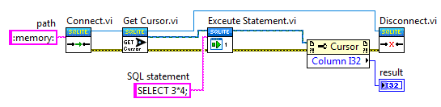

Basic Usage
=========================

The easiest way to use this library is to add the packed library to your project.
The library depends only on the sqlite3.dll.

Add the SQLite3LV.lvlibp packed libary to any LabVIEW™ project

.. figure:: _images/SQLite3_basic_use.*
	:alt: basic usage of SQLite3LV

Executing a simple query
**************************
	
To execute a simple query:

1. Open a database connection
2. Get a cursor
3. Execute a query
4. Collect the result
5. Close the database connection

	

